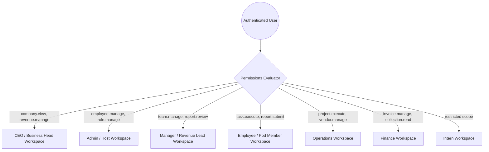

# POC.OPERATION — Complete UI/UX Master Blueprint & System Architecture

**Document Version:** 1.0.0  
**Status:** Approved Master Architecture & Specification  
**Product:** Pinnacle Operations Center (POC.OPERATION)  
**Company:** Pinnacle  
**Stack:** Astro 7 (SSR) + React 19 + TypeScript + Tailwind CSS v4 + Cloudflare Workers + D1 + R2 + Drizzle ORM + Zod  
**Reference Document:** `POC.OPERATION_MASTER_SPEC.md`

---

## 1. DESIGN PHILOSOPHY — "PINNACLE SIGNATURE"

POC.OPERATION is an executive-grade internal operating engine, not a generic bootstrap dashboard or a toy project tracker. The visual direction and user experience follow the **Pinnacle Signature** design philosophy:

* **Executive Calm & High Information Density:** Every screen prioritizes clarity of business status over decoration. Data is compact, scannable, and structured for fast decision-making.
* **Deep Navy Foundation:** The canvas is anchored in deep obsidian and navy surfaces (`#0B1120`, `#111C33`), conveying stability, enterprise security, and 24/7 mission-critical operations.
* **Warm Gold Pinnacle Accents:** Restrained, purposeful gold tones (`#D4AF37`, `#C5A028`) highlight key brand emblems, active nodes, primary commitments, and high-value revenue milestones without ostentation.
* **Cinematic Identity, Functional Interior:** Cinematic mountain imagery and layered atmosphere gradients are reserved strictly for public and authentication gateways (Login, Employee Onboarding). Once inside the authenticated shell, the UI transitions into a razor-sharp, zero-distraction productivity environment.
* **Truth in Visualization:** No meaningless decorative charts or fabricated KPI percentages. All charts, SLA badges, and progress meters map 1:1 to database queries and immutable audit trails.
* **No Color-Only Communication:** Statuses (Critical, At Risk, Watch, On Track) always combine distinct semantic colors with clear typographic labels and iconography for accessibility.

---

## 2. DESIGN TOKENS & SYSTEM SPECIFICATIONS

The design system is implemented natively via Tailwind CSS v4 CSS variables (`@theme` in `src/styles/global.css`):

### 2.1 Color Palette
```css
/* Surface Colors */
--color-surface-base:    #0B1120;  /* Main application background */
--color-surface-card:    #111C33;  /* Content cards, table bodies, modal surfaces */
--color-surface-hover:   #162444;  /* Hover state for rows, cards, and interactive tiles */
--color-surface-active:  #1C2E56;  /* Selected navigation items and active tabs */
--color-surface-subtle:  #1E293B;  /* Recessed panels, input fills, table headers */

/* Brand & Accent */
--color-brand-primary:       #D4AF37;  /* Pinnacle Warm Gold - key CTA, active indicator */
--color-brand-primary-hover: #C5A028;  /* Gold hover state */
--color-brand-secondary:     #2B6CB0;  /* Enterprise steel blue for operational tags */
--color-brand-gold-glow:     rgba(212, 175, 55, 0.25);
--color-brand-gold-muted:    #A38426;

/* Typography Tokens */
--color-text-primary:   #F8FAFC;  /* Headings, primary metrics, active data */
--color-text-secondary: #94A3B8;  /* Field labels, supporting metrics, table headers */
--color-text-tertiary:  #64748B;  /* Timestamps, metadata, hints, disabled labels */
--color-text-inverse:   #0B1120;  /* Text on gold and bright badges */

/* Borders & Dividers */
--color-border-subtle:  #1E293B;  /* Standard card borders, row dividers */
--color-border-default: #334155;  /* Input borders, elevated panel contours */
--color-border-focus:   #D4AF37;  /* Accessible focus ring and active inputs */
--color-border-gold:    rgba(212, 175, 55, 0.4);

/* Semantic Status */
--color-status-success:    #10B981;  /* ON_TRACK, APPROVED, ACTIVE */
--color-status-success-bg: rgba(16, 185, 129, 0.12);
--color-status-warning:    #F59E0B;  /* WATCH, AT_RISK, PENDING_REVIEW */
--color-status-warning-bg: rgba(245, 158, 11, 0.12);
--color-status-error:      #EF4444;  /* CRITICAL, OVERDUE, REJECTED, SUSPENDED */
--color-status-error-bg:   rgba(239, 68, 68, 0.12);
--color-status-info:       #38BDF8;  /* SYSTEM_NOTICE, DRAFT, INFORMATIONAL */
--color-status-info-bg:    rgba(56, 189, 248, 0.12);
```

### 2.2 Typography Scale
Font Family: `'Inter', system-ui, -apple-system, sans-serif`  
Monospace: `'JetBrains Mono', 'Fira Code', ui-monospace, monospace` (for Employee IDs, Currency, Hash, System Timestamps)

| Token | Size | Line Height | Tracking | Weight | Usage |
|---|---|---|---|---|---|
| `display` | 32px (2rem) | 1.2 | -0.02em | 700 (Bold) | Auth Hero, Executive KPI headline |
| `h1` | 24px (1.5rem) | 1.25 | -0.015em | 700 (Bold) | Main page titles |
| `h2` | 20px (1.25rem) | 1.3 | -0.01em | 600 (Semibold) | Section headers, Drawer titles |
| `h3` | 16px (1rem) | 1.4 | -0.005em | 600 (Semibold) | Card titles, Modal headers |
| `body-default` | 14px (0.875rem) | 1.5 | 0 | 400 / 500 | Standard UI text, table cells |
| `body-sm` | 13px (0.8125rem) | 1.45 | 0 | 400 / 500 | Secondary metadata, descriptions |
| `caption` | 11px (0.6875rem) | 1.4 | +0.02em | 500 / 600 | Badges, micro-labels, uppercase tags |
| `numeric-kpi` | 28px (1.75rem) | 1.1 | -0.02em | 700 (Mono) | Financial figures (₹ Cr), achievement % |

### 2.3 Spacing & Radius Scales
* **Spacing Scale:** 4px (`0.25rem`), 8px (`0.5rem`), 12px (`0.75rem`), 16px (`1rem`), 20px (`1.25rem`), 24px (`1.5rem`), 32px (`2rem`), 48px (`3rem`).
* **Radius Scale:**
  * `rounded-sm`: 4px (Badges, tags)
  * `rounded-md`: 6px (Inputs, buttons, dropdown items)
  * `rounded-lg`: 8px (Cards, modal panels, topbar elements)
  * `rounded-xl`: 12px (Major workspace containers, KPI cards)
  * `rounded-full`: 9999px (Pills, user avatars, live indicators)

---

## 3. COMPONENT SYSTEM (ATOMIC TO TEMPLATES)

### 3.1 Atoms
* **`Button`**: Primary (Gold fill, dark text), Secondary (Card surface, subtle border, gold hover), Ghost (Transparent, text hover), Danger (Red outline/fill for reject/terminate), Icon-only.
* **`Badge`**: Semantic status tags (`status-success`, `status-warning`, `status-error`, `status-info`) with icon prefix.
* **`Avatar`**: Employee photo thumbnail with fallback initials and active status pip.
* **`Tooltip`**: Micro-explanations for SLA status, abbreviations, and icon buttons.
* **`CurrencyDisplay`**: Formatted Indian numbering (`₹2.25 Cr`, `₹15.5 Lakh`, `₹45,000`).

### 3.2 Molecules
* **`FormField`**: Accessible label, required asterisk, input/select/textarea, error message anchor, helper text.
* **`SearchInput`**: Embedded magnifying icon, quick clear button (`Esc`), shortcut pill (`Ctrl+K`).
* **`KPICard`**: Metric title, current value, trend indicator (↑/↓ % vs target), contextual baseline, progress bar.
* **`SlaIndicator`**: Icon + multi-level status pill + countdown badge (`Due in 4h` / `Overdue by 2d`).
* **`Breadcrumbs`**: Route ancestry navigation with home anchor and current item indicator.

### 3.3 Organisms
* **`DataTable`**: Column sorting, multi-column search, status filter chips, selection checkboxes, pagination controls, empty state view, row actions dropdown, responsive card view for mobile screens.
* **`MakerCheckerBar`**: Sticky review strip showing maker name, submission timestamp, attached evidence links, and action buttons (`Approve`, `Request Correction`, `Reject with Reason`).
* **`DelayRequestModal`**: Form requiring immutable original date, delay reason category, progress percentage, business impact summary, recovery action plan, and requested revised date.
* **`GlobalSearchModal`**: Keyboard-driven palette searching authorized Employees, Clients, Deals, Tasks, and Invoices.
* **`ImpersonationBanner`**: High-visibility warning bar (`AMBER`) across top of shell with current target identity and instant `Exit Impersonation` button.

### 3.4 Templates
* **`AppShell`**: Desktop Sidebar + Sticky Topbar + Main scrollable viewport + Responsive Drawer.
* **`AuthLayout`**: Split-screen or centered atmospheric card on mountain landscape.
* **`MasterDetailLayout`**: Left pane list/table (40%) + Right pane sticky detail dossier (60%).

---

## 4. APPLICATION SHELL ARCHITECTURE

### 4.1 Shell Layout Structure
```text
+-----------------------------------------------------------------------------------------+
| [IMPERSONATION BANNER: Viewing as Employee S1004 (Rohan Verma) - [EXIT IMPERSONATION] ]  | (Only if active)
+-----------------------------------------------------------------------------------------+
| [LOGO: Pinnacle] | Global Search [Ctrl+K]               | [D1 Active] [Bell(3)] [User Menu] | <- TopBar (h-16)
+------------------+----------------------------------------------------------------------+
| SIDEBAR (w-64)   | BREADCRUMBS: Operations / Tasks / TASK-4091                          |
| Collapsible      +----------------------------------------------------------------------+
|                  | PAGE HEADER: Title, Summary, Primary Action Button                    |
| Core Operations  +----------------------------------------------------------------------+
| - Dashboard      |                                                                      |
| - Tasks          | MAIN CONTENT CONTAINER (max-w-7xl mx-auto px-6 py-6)                 |
| - CRM / Clients  | Dynamic workspace views mount here                                    |
| - Opportunities  |                                                                      |
|                  |                                                                      |
| System           |                                                                      |
| - Governance     |                                                                      |
| - Settings       |                                                                      |
+------------------+----------------------------------------------------------------------+
| v1.0.0-PROD      | (C) 2026 Pinnacle Operations. Confidential & Proprietary.            | <- Footer
+-----------------------------------------------------------------------------------------+
```

### 4.2 Key Shell Behaviors
1. **Collapsible Sidebar:** Toggles between 260px (expanded) and 72px (compact icon-only) with persistent preference stored in `localStorage`.
2. **Permission-Aware Filter:** Topbar and Sidebar consume the authenticated principal's permission array (`Astro.locals.auth` on SSR, props on React Island). Unassigned modules are hidden from navigation, and unauthorized routes return HTTP 403 on the server.
3. **Active Node Heartbeat:** Real-time indicator in TopBar verifying live Cloudflare D1 connection.
4. **User Profile Dropdown:** Displays Employee ID (e.g., `S1001`), Full Name, Primary Role, quick links to Profile/Settings, and CSRF-protected Sign Out.

---

## 5. ROLE-BASED NAVIGATION ARCHITECTURE

Navigation derives dynamically from the user's granted permissions:



### 5.1 Route-to-Permission Mapping Matrix

| Navigation Item | Target URL | Required Permission | Primary Roles |
|---|---|---|---|
| **Executive Center** | `/executive` | `company.view` | CEO, Business Head |
| **Operations Overview** | `/dashboard` | *(Authenticated)* | All Users |
| **My Tasks & Targets** | `/tasks` | `task.execute` | Employee, Intern, Manager |
| **Team Management** | `/team` | `team.manage` | Manager, Business Head |
| **Client Roster (CRM)** | `/crm/clients` | `client.read` | Revenue Pods, Managers, Admin, CEO |
| **Deal Pipeline** | `/crm/opportunities` | `opportunity.read` | Revenue Pods, Managers, CEO |
| **Daily Reports Review** | `/governance/reports` | `report.review` | Manager, Business Head |
| **Task Verification** | `/governance/verification` | `task.verify` | Checker, Manager |
| **Delay Approvals** | `/governance/delays` | `delay.approve` | Manager, Business Head |
| **Projects & Milestones**| `/operations/projects` | `project.read` | Operations, Pods, CEO |
| **Vendor Directory** | `/operations/vendors` | `vendor.read` | Operations, Finance |
| **Invoices & Ageing** | `/finance/invoices` | `finance.read` | Finance, CEO, Business Head |
| **Collections** | `/finance/collections` | `collection.read` | Finance, Revenue Pod Leads |
| **Employee Directory** | `/admin/employees` | `employee.read` | Admin, HR, Managers |
| **Registration Queue** | `/admin/registrations` | `employee.approve_registration` | Admin |
| **Roles & Permissions** | `/admin/roles` | `role.manage` | Admin |
| **Audit Log Explorer** | `/admin/audit` | `audit.read` | Admin, Compliance, CEO |
| **Issue Register** | `/support/issues` | `issue.read` | All Staff |
| **Support Tickets** | `/support/tickets` | `ticket.read` | All Staff |

---

## 6. COMPLETE SCREEN INVENTORY

| Screen ID | Route | Primary Role | Purpose & Capabilities | Core Data Displayed | Key Components |
|---|---|---|---|---|---|
| **AUTH-01** | `/` | Guest | Enterprise login gateway | Employee ID / Email, Password | `LoginForm`, `PinnacleLogo`, `Alert` |
| **AUTH-02** | `/register` | Guest | 9-stage employee application | Personal, address, career, docs | `RegisterPage`, `PasswordInput` |
| **AUTH-03** | `/register/status` | Guest | Check application status | Application ID, review state | `StatusCard`, `Timeline` |
| **DASH-01** | `/dashboard` | All | Role-tailored home overview | Summary KPI cards, urgent work | `AppShell`, `KPICard`, `TaskMiniTable` |
| **EXEC-01** | `/executive` | CEO | Executive Command Center | ₹4 Cr pod breakdown, SLA health | `RevenuePodGrid`, `SlaMatrix`, `RiskBoard` |
| **EXEC-02** | `/executive/drilldown`| CEO | Deep operational inspection | Org tree down to task level | `OrgTreeNav`, `DossierDrawer` |
| **MGR-01** | `/team` | Manager | Team performance & workload | Members, targets, achievement | `TeamTable`, `WorkloadMeter` |
| **MGR-02** | `/governance/reports` | Manager | Daily work report approvals | Submitted reports, activities | `DailyReportViewer`, `ReviewActionBar` |
| **MGR-03** | `/governance/delays` | Manager/CEO | Delay request sign-offs | Frozen original date, recovery plan | `DelayApprovalModal`, `SlaBadge` |
| **EMP-01** | `/tasks` | Employee | Personal task management | Task list, priorities, deadlines | `TaskFilterBar`, `TaskCard`, `EvidenceUpload`|
| **EMP-02** | `/tasks/[id]` | Employee | Detailed task execution | Deliverable history, checker status | `TaskDetailView`, `CommentThread` |
| **EMP-03** | `/daily-report` | Employee | Daily operational logging | Calls, meetings, proposals, hours | `DailyReportComposer`, `ActivityLogger` |
| **CRM-01** | `/crm/clients` | Sales/Pod | Client master directory | Accounts, assigned staff, balance | `DataTable`, `ClientFilterChips` |
| **CRM-02** | `/crm/clients/[id]`| Sales/Pod | Complete client profile | Contacts, deals, meetings, invoices | `ClientDossier`, `Many2ManyStaffTag` |
| **CRM-03** | `/crm/opportunities`| Sales/Pod | Visual revenue pipeline | Stages: Lead -> Proposal -> Closed | `PipelineBoard`, `DealCard` |
| **OPS-01** | `/operations/projects`| Ops | Project lifecycle execution | Milestones (Fab, Setup, Live) | `GanttTimeline`, `MilestoneTracker` |
| **OPS-02** | `/operations/vendors` | Ops | Vendor master & active jobs | Vendor category, rating, location | `VendorTable`, `RatingPill` |
| **FIN-01** | `/finance/invoices` | Finance | Invoicing & ageing register | Aging buckets (30/60/90+ days) | `AgeingChart`, `InvoiceDataTable` |
| **FIN-02** | `/finance/collections`| Finance | Collections & follow-up log | Outstanding, payment receipts | `CollectionTracker`, `ReceiptModal` |
| **ADM-01** | `/admin/employees` | Admin | Workforce master management | Active/Suspended staff, department | `EmployeeDirectory`, `EditStaffDrawer`|
| **ADM-02** | `/admin/registrations`| Admin | Onboarding approval & docs | Identity docs, approve/reject | `RegistrationReviewer`, `DocPreview` |
| **ADM-03** | `/admin/roles` | Admin | Roles & permission matrices | System roles, custom overrides | `PermissionMatrixTable`, `OverrideModal`|
| **ADM-04** | `/admin/audit` | Admin/CEO | Immutable audit log trail | Timestamp, user, action, diff | `AuditLogExplorer`, `JsonDiffViewer` |
| **SUP-01** | `/support/tickets` | All | Formal internal support tickets| Ticket ID, priority, status | `TicketTable`, `TicketDetailDrawer` |
| **SUP-02** | `/support/issues` | All | Enterprise Issue Register | Issue severity, owner, resolution | `IssueRegisterGrid`, `EscalateButton` |

---

## 7. CORE WORKSPACE UX DESIGNS

### 7.1 CEO Executive Command Center (`/executive`)
* **Core Question Answered:** *"What is happening across the entire company, where are we winning, where are we losing, and what requires my immediate decision?"*
* **Revenue Pod Scorecard:**
  * **Existing Client Revenue Pod:** Target: ₹2.25 Cr | Actual: Live Sum | % Progress Bar | Run-rate
  * **Growth Revenue Pod:** Target: ₹1.50 Cr | Actual: Live Sum | % Progress Bar | Conversion %
  * **Strategic Opportunity Pool:** Target: ₹25 Lakh | Actual: Live Sum | High-touch deals
  * **Consolidated:** Target: ₹4.00 Cr | Total Invoiced | Total Collected | Outstanding Gap
* **Executive Attention Strip:** Immediate list of P1 Escalations, overdue critical deliverables (>48h), and pending strategic delay requests.
* **Multi-Tier Drilldown:** Company → Revenue Pod → Manager → Pod Member → Client → Deal → Deliverable.

### 7.2 Manager Workspace (`/team`, `/governance/*`)
* **Team Health Dashboard:** Visual workload matrix showing tasks per employee, SLA compliance rate, and weekly revenue progress.
* **Daily Report Review Stream:** Side-by-side view of an employee's submitted hours, meetings held, clients contacted, and proposals sent. Includes inline feedback and 1-click `Approve` or `Reject with Guidance`.
* **Maker-Checker Verification Queue:** Filterable queue of completed tasks awaiting formal manager verification before milestone clearance.

### 7.3 Employee Cockpit (`/tasks`, `/daily-report`)
* **Daily Rhythm Guidance:**
  * Monday: Planning & target allocation
  * Tuesday: Client outreach & initial contact
  * Wednesday: Proposal delivery & scoping
  * Thursday: Deal conversion & client sign-offs
  * Friday: Performance review, collections & recovery
* **Task Workbench:** High-contrast P1/P2/P3 task cards with countdown timers, clear deliverables, and embedded proof submission (URLs, document uploads, client email confirmations).
* **Daily Work Log:** Rapid logging interface that auto-populates completed tasks and meetings into the draft daily report.

### 7.4 Admin Control Center (`/admin/*`)
* **Registration Review Station:** Dual-column review UI displaying applicant data on the left and sensitive documents (Aadhaar, PAN, photo) on the right. Form requires department and designation assignment on approval, or mandatory reason logging on rejection.
* **Permission Governance Matrix:** Interactive matrix listing permissions as columns and roles as rows, with color-coded inheritance indicators.
* **Impersonation Action ("Access as Employee"):** Requires explicit reason input; generates high-priority audit record; launches employee view with top amber banner; terminates immediately upon clicking `Exit Impersonation`.

---

## 8. BUSINESS WORKFLOW & GOVERNANCE UX

### 8.1 Maker–Checker UX Flow
```text
[MAKER]                                                [CHECKER]
Executes task -> Uploads evidence -> Submits for review
                                                             |
                                                             v
                                                   Reviews proof & SLA
                                                   /                 \
                                    [APPROVE]                         [REJECT]
                                        |                                 |
                          Status -> VERIFIED_COMPLETED        Enters mandatory correction notes
                          Milestone unblocked                 Status -> REWORK_REQUESTED
                                                              Task returns to Maker
```
* **Rule:** Maker and Checker must never be the same user ID. The UI disables and hides the verification button for the creator/assignee of a task.

### 8.2 Delay Request & Immutable SLA UX
* **Immutable Deadline Principle:** When an employee or manager requests a deadline extension, the original deadline remains permanently visible in a locked badge (`Orig: 12 Oct`).
* **Delay Form Requirements:**
  1. Root cause category (Client delay, Vendor delay, Scope creep, Technical impediment).
  2. Estimated completion percentage at time of request.
  3. Anticipated business/financial impact.
  4. Explicit recovery action plan.
  5. Proposed new delivery date.
* **Approver Actions:** Approvers can `Approve Extension`, `Reject Extension`, `Demand Alternate Recovery`, or `Escalate to P1 Priority`.
* **SLA Calculation & Display:**
  * **ON TRACK (>=95%):** Green badge + Checkmark icon.
  * **WATCH (85–94%):** Amber badge + Eye icon.
  * **AT RISK (70–84%):** Orange badge + Alert triangle icon.
  * **CRITICAL (<70%):** Red badge + Siren icon.
  * **OVERDUE:** Dark Red filled badge + Clock icon + Elapsed time counter.

### 8.3 Revenue Chain Visual Pipeline
```text
Activity (Call/Meeting) -> Opportunity -> Proposal Delivered -> Conversion / PO 
  -> Project Setup -> Operational Execution -> Invoice Generated -> Collection -> Revenue / Profit
```
Every deal card in the pipeline displays:
* Client Company Name & Logo/Initials
* Deal Monetary Value (e.g., `₹12,50,000`)
* Assigned Revenue Pod (Existing / Growth / Strategic)
* Probability % & Forecasted Value
* Next Action & Due Date
* SLA health status

---

## 9. INTERACTION, ACCESSIBILITY & RESPONSIVE PATTERNS

### 9.1 Data Table UX Standards
* **Density:** Default 48px row height with compact 36px toggle for high-density analysis.
* **Sticky Elements:** Sticky table header and sticky rightmost action column.
* **Row Selection:** Checkbox selection for authorized bulk actions (e.g., bulk task reassignment, batch invoice reminders).
* **Mobile Transformation:** Below 768px (`md`), standard wide tables reflow into stacked cards displaying prioritized primary fields (Title, Status, Owner, Due Date) with an expander drawer for complete metadata.

### 9.2 Modal, Dialog & Drawer Patterns
* **Modals:** Centered dialogs with dark backdrop blur (`backdrop-blur-md bg-black/60`), autofocus on first interactive element, escape key dismissal, and backdrop click cancellation.
* **Confirmation Dialogs:** Used for destructive operations (Reject Registration, Suspend Employee, Revoke Override, Delete Draft). Destructive button has high-contrast red styling and requires explicit confirmation.
* **Slide-over Drawers (Width: 480px or 640px):** Used for dossiers, detail inspection, and quick creation flows without taking the user away from their active list view.

### 9.3 Accessibility & Focus Management
* **Target:** WCAG 2.1 AA Compliance.
* **Focus Rings:** Universal 2px gold outline (`ring-2 ring-brand-primary ring-offset-2 ring-offset-surface-base`) on all interactive buttons, links, and inputs.
* **Screen Reader Support:** Semantic HTML5 (`<main>`, `<nav>`, `<aside>`, `<header>`, `<table>`, `<th> scope="col"`), descriptive `aria-label` attributes on icon-only controls, and `aria-live="polite"` on notification badges and async status updates.

### 9.4 Loading, Empty & Error States
* **Loading:** Geometry-matched skeleton placeholders pulsating subtly (`animate-pulse bg-surface-subtle/60`). No full-screen blocking spinners.
* **Empty States:** Clean icon, title explaining the absence of records, clear explanation, and primary action button (e.g., *"No tasks assigned. Create your first task or request assignment"*).
* **Error States:** Informative banners with correlation error codes, human-readable troubleshooting guidance, and safe retry handlers without page reload.

---

## 10. SYSTEM IMPLEMENTATION SEQUENCE

Implementation proceeds systematically across ordered phases to maintain complete stability and continuous build verification:

```text
+-----------------------------------------------------------------------------------+
| Phase 4A: Global Design System & Component Library (Tokens, UI Atoms, Molecules)  |
+-----------------------------------------------------------------------------------+
                                         |
                                         v
+-----------------------------------------------------------------------------------+
| Phase 4B: Application Shell (Sidebar, TopBar, MobileNav, Breadcrumbs, User Menu)  |
+-----------------------------------------------------------------------------------+
                                         |
                                         v
+-----------------------------------------------------------------------------------+
| Phase 4C: Complete Authentication UI (Sign In, 9-Stage Registration, Status)      |
+-----------------------------------------------------------------------------------+
                                         |
                                         v
+-----------------------------------------------------------------------------------+
| Phase 4D: Employee Operational Cockpit (Tasks, Targets, Daily Report, Profile)    |
+-----------------------------------------------------------------------------------+
                                         |
                                         v
+-----------------------------------------------------------------------------------+
| Phase 4E: Manager Workspace (Team Health, Review Stream, Verification Queue)      |
+-----------------------------------------------------------------------------------+
                                         |
                                         v
+-----------------------------------------------------------------------------------+
| Phase 4F: Admin Control Center (Employees, Onboarding Review, Roles/Perms, Audit) |
+-----------------------------------------------------------------------------------+
                                         |
                                         v
+-----------------------------------------------------------------------------------+
| Phase 4G: CEO Executive Center (Company Health, Revenue Pods, Escalations, Drill) |
+-----------------------------------------------------------------------------------+
                                         |
                                         v
+-----------------------------------------------------------------------------------+
| Phase 4H: CRM & Revenue Pipeline (Client Master, Deals, Stages, Follow-ups)       |
+-----------------------------------------------------------------------------------+
                                         |
                                         v
+-----------------------------------------------------------------------------------+
| Phase 4I: Governance & SLA (Maker-Checker, Delay Requests, SLA Engine)            |
+-----------------------------------------------------------------------------------+
                                         |
                                         v
+-----------------------------------------------------------------------------------+
| Phase 4J: Projects, Operations & Vendors (Event Milestones, Dispatch, Vendor Directory)|
+-----------------------------------------------------------------------------------+
                                         |
                                         v
+-----------------------------------------------------------------------------------+
| Phase 4K: Finance Engine (Invoices, Ageing 30/60/90, Collections, Receipts)       |
+-----------------------------------------------------------------------------------+
                                         |
                                         v
+-----------------------------------------------------------------------------------+
| Phase 4L: Communications & Central Hub (Notifications, Tickets, Issues, Chat)     |
+-----------------------------------------------------------------------------------+
                                         |
                                         v
+-----------------------------------------------------------------------------------+
| Phase 4M: Final Responsive Optimization, Accessibility Audit & Visual Polish     |
+-----------------------------------------------------------------------------------+
```

---

## 11. OPEN ARCHITECTURAL DECISIONS & EXTENSIBILITY

1. **R2 Document Storage:** During prototype phases, identity documents utilize mock storage references. When transitioning to live R2 object storage, the existing `employee_documents` schema will receive signed presigned URL generation with strict TTLs and permission validation.
2. **Real-time Notifications:** WebSockets / Cloudflare Durable Objects are deferred until Phase 11. In Phase 4, notifications leverage fast D1 polling on navigation transitions.
3. **Indian Rupee Formatting:** All currency representations format in Lakhs and Crores (`₹X.XX Cr` / `₹X.XX Lakh`) with standard international fallback where specified.
4. **Data Scope Enforcement:** The database queries strictly enforce `dataScope: 'SELF' | 'TEAM' | 'COMPANY'` from the user's role assignments, ensuring no user can inspect records outside their authorized jurisdiction regardless of UI state.
